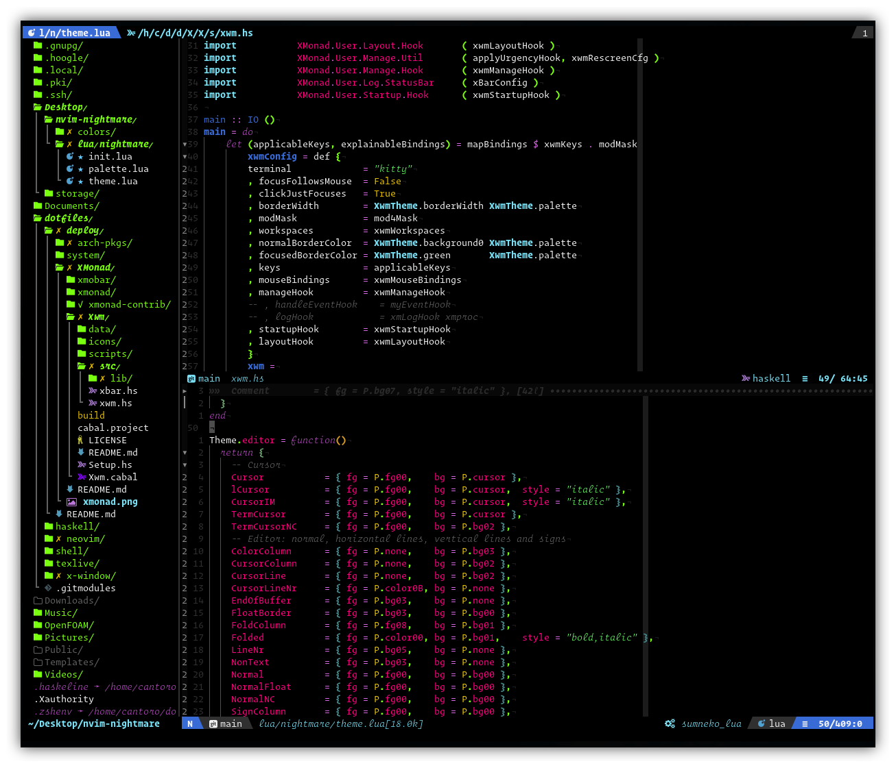

# nvim-nightmare

## 🐺 Why and How

I was bored by always using my favourite colorscheme, [ayu](https://github.com/ayu-theme/ayu-vim), or my [personal version](https://github.com/CantoroMC/ayu-nvim)  written in Lua, of it, so I 've searched through a [database of colorschemes](https://github.com/mbadolato/iTerm2-Color-Schemes) for terminals to see I can find a pleasing and very dark colorscheme.

I've came up against Paul Millr colorscheme and decided to make it my own Vim/NeoVim colorscheme.


The theme uses the 16 colors of [Paul Millr colorscheme for Kitty](https://github.com/mbadolato/iTerm2-Color-Schemes/blob/master/kitty/PaulMillr.conf) and a scale of background and foreground colors obtained through interpolation of those reported in the kitty colorscheme.
Suggestions on how to allocate the color ladder to the various highlighting groups are taken from [nvim-base16](https://github.com/RRethy/nvim-base16) and from various suggestions founded browsing the web (I cannot find back those sources).

## ✨ Features


- The theme have no options on purpose and none will be added in the future, in my view themes should be used as designed without need to additional tweaks. Anyway I'm open to any change in better.
- "Asynchronous" highlight loading of plugins, lsp and filetype specific highlighting groups.
- "__Heavy__" use of _italics_
- 🔌 Supported Plugins<br>
Theoretically all plugins are already supported since as a standard their highlighting groups are linked to the Nvim builtin highlighting groups. Anyway some plugins are specifically tweaked.
  + [TreeSitter](https://github.com/nvim-treesitter/nvim-treesitter)
  + [LSP Diagnostics](https://neovim.io/doc/user/lsp.html)
  + [fugitive](https://github.com/tpope/vim-fugitive)
  + [Indent-Blankline.nvim](https://github.com/lukas-reineke/indent-blankline.nvim)
  + [nvim-cmp](https://github.com/hrsh7th/nvim-cmp)
  + [Nvim-Tree.lua](https://github.com/kyazdani42/nvim-tree.lua)
  + [symbol outline](https://github.com/simrat39/symbols-outline.nvim)
  + [startify](https://github.com/mhinz/vim-startify)
  + [termdebug](https://github.com/neovim/neovim/blob/master/runtime/pack/dist/opt/termdebug/plugin/termdebug.vim)
  + [Lualine.nvim](https://github.com/nvim-lualine/lualine.nvim)
- Tweaked Filetype Highlighting Groups
  + diff files
  + markdown

## ⚡️ Requirements

+ Neovim >= 0.5.0

## ⚙️ Installation and Usage

You can install it as every other plugin, with your package manager or by dropping it in neovim' s `runtimepath`, and then you can activate it (the theme is saved as `nightmare`) as always with
```vim
colorscheme nightmare
```
or with
```lua
require'nightmare'.apply()
```

## 🤝 Contribution and Todos
Any contributions is welcomed and encouraged.
- Better english in this README
- Additional plugins tweaks
- Additional filetype specific tweaks
